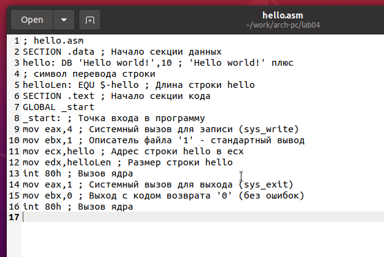

---
## Front matter
title: "Отчёт по лабораторной работе 4"
subtitle: "Создание и процесс обработки программ на языке ассемблера NASM"
author: "Татьяна Соколова НММбд-03-24 "

## Generic otions
lang: ru-RU
toc-title: "Содержание"

## Bibliography
bibliography: bib/cite.bib
csl: pandoc/csl/gost-r-7-0-5-2008-numeric.csl

## Pdf output format
toc: true # Table of contents
toc-depth: 2
lof: true # List of figures
lot: true # List of tables
fontsize: 12pt
linestretch: 1.5
papersize: a4
documentclass: scrreprt
## I18n polyglossia
polyglossia-lang:
  name: russian
  options:
	- spelling=modern
	- babelshorthands=true
polyglossia-otherlangs:
  name: english
## I18n babel
babel-lang: russian
babel-otherlangs: english
## Fonts
mainfont: PT Serif
romanfont: PT Serif
sansfont: PT Sans
monofont: PT Mono
mainfontoptions: Ligatures=TeX
romanfontoptions: Ligatures=TeX
sansfontoptions: Ligatures=TeX,Scale=MatchLowercase
monofontoptions: Scale=MatchLowercase,Scale=0.9
## Biblatex
biblatex: true
biblio-style: "gost-numeric"
biblatexoptions:
  - parentracker=true
  - backend=biber
  - hyperref=auto
  - language=auto
  - autolang=other*
  - citestyle=gost-numeric
## Pandoc-crossref LaTeX customization
figureTitle: "Рис."
tableTitle: "Таблица"
listingTitle: "Листинг"
lofTitle: "Список иллюстраций"
lotTitle: "Список таблиц"
lolTitle: "Листинги"
## Misc options
indent: true
header-includes:
  - \usepackage{indentfirst}
  - \usepackage{float} # keep figures where there are in the text
  - \floatplacement{figure}{H} # keep figures where there are in the text
---

# Цель работы

Целью работы является освоение процедуры компиляции и сборки программ, написанных на ассемблере NASM.

# Задание

1. Изучите программу HelloWorld и скомпилируйте ее.

2. С помощью любого текстового редактора внесите изменения в текст программы так, 
чтобы вместо Hello world! на экран выводилась строка с вашими фамилией и именем.

3. Скомпилируйте новую программу и проверьте ее работу.

4. Загрузите файлы на GitHub.

# Теоретическое введение

NASM (англ. Netwide Assembler) – это 80x86 ассемблер, разработанный исходя из принципов переносимости и модульности. Он поддерживает широкий диапазон форматов объектных файлов, включая форматы Linuxa.out и ELF, NetBSD/FreeBSD, COFF, Microsoft 16-bit OBJ и Win32. Он способен также создавать простые бинарные файлы. Синтакс NASM максимально упрощен для понимания и похож на синакс Intel, но слегка посложнее. Он поддерживает инструкции Pentium, P6 и MMX, а также имеет макро-расширения.

NASM был создан Саймоном Тэтхемом совместно с Юлианом Холлом и в настоящее время развивается небольшой командой разработчиков на SourceForge.net. Первоначально он был выпущен согласно его собственной лицензии, но позже эта лицензия была заменена на GNU LGPL после множества проблем, вызванных выбором лицензии. Начиная с версии 2.07 лицензия заменена на «упрощённую BSD» (BSD из 2 пунктов).

NASM может работать на платформах, отличных от x86, таких как SPARC и PowerPC, однако код он генерирует только для x86 и x86-64.

NASM успешно конкурирует со стандартным в Linux- и многих других UNIX-системах ассемблером gas. Считается, что качество документации у NASM выше, чем у gas. Кроме того, ассемблер gas по умолчанию использует AT&T-синтаксис, ориентированный на процессоры не от Intel, в то время как NASM использует вариант традиционного для x86-ассемблеров Intel-синтаксиса; Intel-синтаксис используется всеми ассемблерами для под DOS/Windows, например, MASM, TASM, fasm.

В NASM используется Intel-синтаксис записи инструкций. Предложение языка ассемблера NASM (строка программы) может состоять из следующих элементов:Метка, Инструкция, Операнды, Комментарий.

Операнды отделяются между собой запятой. Перед строкой и после инструкции можно использовать любое количество пробельных символов. Комментарий начинается с точки с запятой, а концом комментария считается конец строки. В качестве инструкции может использоваться команда или псевдокоманда (директива компилятора). Если строка очень длинная, то её можно перенести на следующую, используя обратный слеш ( \ ), подобно тому, как это делается в языке Си.

# Выполнение лабораторной работы

##  Программа Hello world!

Создаю каталог lab04 командой mkdir, перехожу в него с помощью команды cd, создаю файл hello.asm. (рис. [-@fig:001])

{ #fig:001 width=70%, height=70% }

Открыла файл и написала код программы по заданию.(рис. [-@fig:002])

{ #fig:002 width=70%, height=70% }

## Транслятор NASM 

Транслирую файл командой nasm. Получился объектный файл hello.o (рис. [-@fig:003])

{ #fig:003 width=70%, height=70% }

Транслирую файл командой nasm с дополнительными опциями. (рис. [-@fig:004])
Получился файл листинга list.lst, объектный файл obj.o, в программу добавилась отладочная информация.

{ #fig:004 width=70%, height=70% }

## Компоновщик LD

Выполняю линковку командой ld и получил исполняемый файл. (рис. [-@fig:005])

{ #fig:005 width=70%, height=70% }

Еще раз выполняю линковку для объектного файла obj.o и получаю исполняемый файл main.(рис. [-@fig:006])

{ #fig:006 width=70%, height=70% }

Запускаю исполняемые файлы.(рис. [-@fig:007])

{ #fig:007 width=70%, height=70% }

## Выполнение заданий для самостоятельной работы.

Копирую программу в новый файл.

Изменяю сообщение Hello world на свое имя (рис. [-@fig:008]) и запускаю новую программу. (рис. [-@fig:009])

{ #fig:008 width=70%, height=70% }

{ #fig:009 width=70%, height=70% }

# Выводы

При выполнении данной лабораторной работы я освоила процесс компиляции и сборки программ, написанных на ассемблере nasm.

# Список литературы{.unnumbered}

1. Архитектура ЭВМ

2. NASM Assembly Language Tutorials. — 2021. — URL: https://asmtutor.com/.