---
## Front matter
title: "Отчёт по лабораторной работе 6"
subtitle: "Арифметические операции в NASM"
author: "Татьяна Соколова НММбд-03-24"

## Generic otions
lang: ru-RU
toc-title: "Содержание"

## Bibliography
bibliography: bib/cite.bib
csl: pandoc/csl/gost-r-7-0-5-2008-numeric.csl

## Pdf output format
toc: true # Table of contents
toc-depth: 2
lof: true # List of figures
lot: true # List of tables
fontsize: 12pt
linestretch: 1.5
papersize: a4
documentclass: scrreprt
## I18n polyglossia
polyglossia-lang:
  name: russian
  options:
	- spelling=modern
	- babelshorthands=true
polyglossia-otherlangs:
  name: english
## I18n babel
babel-lang: russian
babel-otherlangs: english
## Fonts
mainfont: PT Serif
romanfont: PT Serif
sansfont: PT Sans
monofont: PT Mono
mainfontoptions: Ligatures=TeX
romanfontoptions: Ligatures=TeX
sansfontoptions: Ligatures=TeX,Scale=MatchLowercase
monofontoptions: Scale=MatchLowercase,Scale=0.9
## Biblatex
biblatex: true
biblio-style: "gost-numeric"
biblatexoptions:
  - parentracker=true
  - backend=biber
  - hyperref=auto
  - language=auto
  - autolang=other*
  - citestyle=gost-numeric
## Pandoc-crossref LaTeX customization
figureTitle: "Рис."
tableTitle: "Таблица"
listingTitle: "Листинг"
lofTitle: "Список иллюстраций"
lotTitle: "Список таблиц"
lolTitle: "Листинги"
## Misc options
indent: true
header-includes:
  - \usepackage{indentfirst}
  - \usepackage{float} # keep figures where there are in the text
  - \floatplacement{figure}{H} # keep figures where there are in the text
---

# Цель работы

Целью работы является освоение арифметических инструкций языка ассемблера NASM.

# Задание

1. Изучить синтаксис арифметических операций в ассемблере

2. Разобрать примеры программ

3. Выполнить самостоятельное задание

# Теоретическое введение

В ассемблере можно выделить следующие базовые операции:

* Схема команды целочисленного сложения add (от англ. addition - добавление) выполняет сложение двух операндов и записывает результат по адресу первого операнда.

* Команда целочисленного вычитания sub (от англ. subtraction – вычитание) работает аналогично команде add.

* Существуют специальные команды: inc (от англ. increment) и dec (от англ. decrement), которые увеличивают и уменьшают на 1 свой операнд.

* Умножение и деление, в отличии от сложения и вычитания, для знаковых и беззнаковых чисел производиться по-разному, поэтому существуют различные команды. Для беззнакового умножения используется команда mul (от англ. multiply – умножение), для знакового умножения используется команда imul.

* Для деления, как и для умножения, существует 2 команды div (от англ. divide - деление) и idiv

# Выполнение лабораторной работы

## Символьные и численные данные в NASM

Создаю каталог для программам лабораторной работы № 6, перехожу в него и создаю файл lab6-1.asm. 

Рассмотрим примеры программ вывода символьных и численных значений. 
Программы будут выводить значения, записанные в регистр eax.

В данной программе в регистр eax записывается символ 6 (mov eax,'6'), в регистр ebx символ 4 (mov ebx,'4').
Далее к значению в регистре eax прибавляем значение регистра ebx (add eax,ebx, результат сложения запишется в регистр eax). 
Далее выводим результат. (рис. [-@fig:001]) (рис. [-@fig:002])

Так как для работы функции sprintLF в регистр eax должен быть записан адрес, необходимо использовать дополнительную переменную. 
Для этого запишем значение регистра eax в переменную buf1 (mov [buf1],eax), 
а затем запишем адрес переменной buf1 в регистр eax (mov eax,buf1) и вызовем функцию sprintLF.

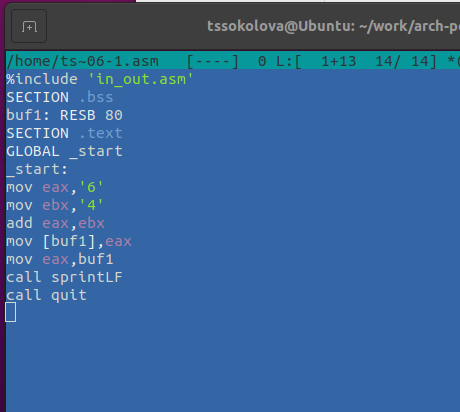{ #fig:001 width=70%, height=70% }

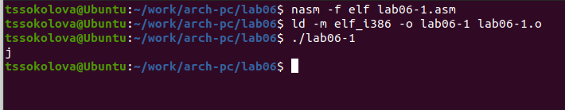{ #fig:002 width=70%, height=70% }

В данном случае при выводе значения регистра eax мы ожидаем увидеть число 10. 
Однако результатом будет символ j. 
Это происходит потому, что код символа 6 равен 00110110 в двоичном представлении (или 54 в десятичном представлении), 
а код символа 4 – 00110100 (52).  Команда add eax,ebx запишет в регистр eax сумму кодов – 01101010 (106), 
что в свою очередь является кодом символа j.

Далее изменяю текст программы и вместо символов, запишем в регистры числа.  (рис. [-@fig:003]) (рис. [-@fig:004])

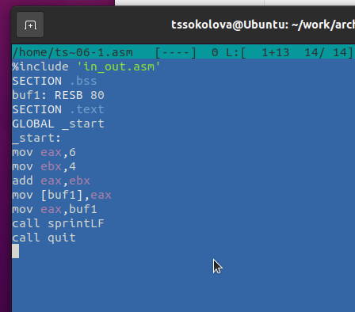{ #fig:003 width=70%, height=70% }

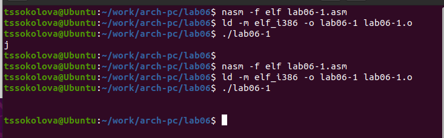{ #fig:004 width=70%, height=70% }

Как и в предыдущем случае при исполнении программы мы не получим число 10. В данном
случае выводится символ с кодом 10. Это символ конца строки (возврат каретки).
В консоле он не отображается, но добавляет пустую строку.

Как отмечалось выше, для работы с числами в файле in_out.asm реализованы 
подпрограммы для преобразования ASCII символов в числа и обратно. 
Преобразую текст программы с использованием этих функций. (рис. [-@fig:005]) (рис. [-@fig:006])

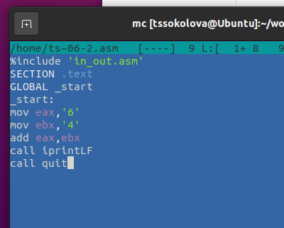{ #fig:005 width=70%, height=70% }

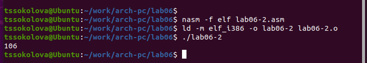{ #fig:006 width=70%, height=70% }

В результате работы программы мы получим число 106. В данном случае, как и в первом, 
команда add складывает коды символов ‘6’ и ‘4’ (54+52=106). 
Однако, в отличии от прошлой программы, функция iprintLF позволяет вывести число, 
а не символ, кодом которого является это число.

Аналогично предыдущему примеру изменим символы на числа. (рис. [-@fig:007]) (рис. [-@fig:008])

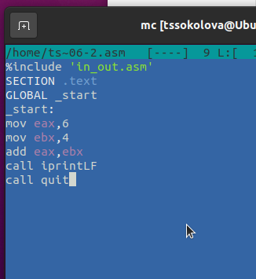{ #fig:007 width=70%, height=70% }

Функция iprintLF позволяет вывести число и операндами были числа (а не коды символов).
Поэтому получаем число 10.

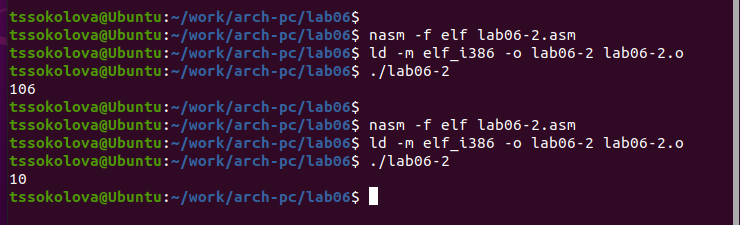{ #fig:008 width=70%, height=70% }

Заменила функцию iprintLF на iprint. Создала исполняемый файл и запустила его. 
Вывод отличается тем, что нет переноса строки. (рис. [-@fig:009])

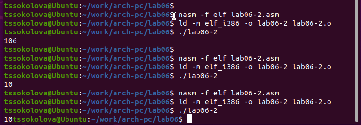{ #fig:009 width=70%, height=70% }

## Выполнение арифметических операций в NASM

 В качестве примера выполнения арифметических операций в NASM приведем 
программу вычисления арифметического выражения $f(x) = (5 * 2 + 3)/3$. (рис. [-@fig:010]) (рис. [-@fig:011])

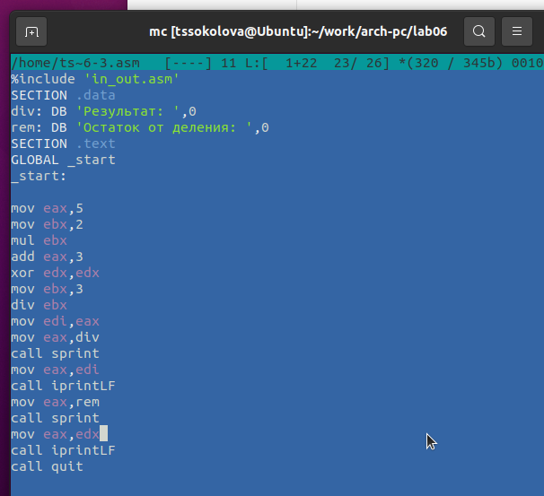{ #fig:010 width=70%, height=70% }

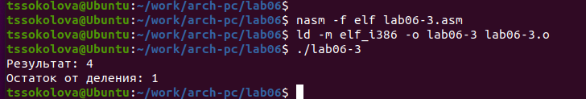{ #fig:011 width=70%, height=70% }

Изменила текст программы для вычисления выражения 
$f(x) = (4 * 6 + 2)/5$. 
Создала исполняемый файл и проверила его работу. (рис. [-@fig:012]) (рис. [-@fig:013])

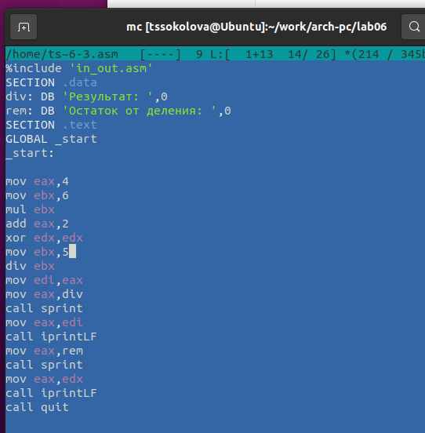{ #fig:012 width=70%, height=70% }

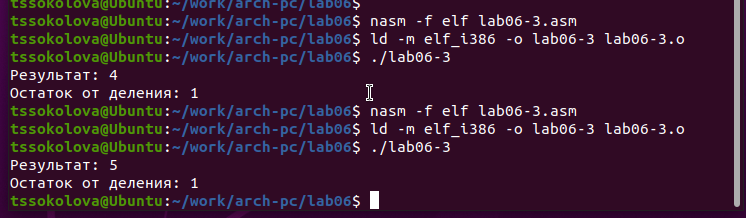{ #fig:013 width=70%, height=70% }

В качестве другого примера рассмотрим программу вычисления варианта задания по 
номеру студенческого билета. (рис. [-@fig:014]) (рис. [-@fig:015])

В данном случае число, над которым необходимо проводить арифметические операции,
вводится с клавиатуры. Как отмечалось выше ввод с клавиатуры осуществляется 
в символьном виде и для корректной работы арифметических операций в NASM символы 
необходимо преобразовать в числа. Для этого может быть использована функция 
atoi из файла in_out.asm.

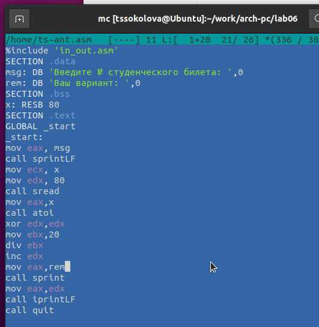{ #fig:014 width=70%, height=70% }

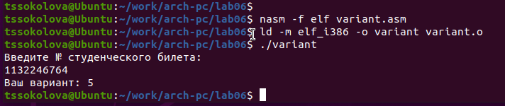{ #fig:015 width=70%, height=70% }

## Ответы на вопросы

1. Какие строки листинга отвечают за вывод на экран сообщения ‘Ваш вариант:’?

* Инструкция "mov eax, rem" перекладывает значение переменной с фразой ‘Ваш вариант:’ в регистр eax.

* Инструкция "call sprint" вызывает подпрограмму для вывода строки.

2. Для чего используется следующие инструкции?

* Инструкция "mov ecx, x" используется для перемещения значения переменной x в регистр ecx.

* Инструкция "mov edx, 80" используется для перемещения значения 80 в регистр edx.

* Инструкция "call sread" вызывает подпрограмму для считывания значения студенческого билета из консоли

3. Для чего используется инструкция “call atoi”?

* Инструкция “call atoi” используется для преобразования введенных символов в числовой формат.

4. Какие строки листинга отвечают за вычисления варианта?

* Инструкция "xor edx, edx" обнуляет регистр edx.

* Инструкция "mov ebx, 20" записывает значение 20 в регистр ebx.

* Инструкция "div ebx" выполняет деление номера студенческого билета на 20.

* Инструкция "inc edx" увеличивает значение регистра edx на 1.

Здесь происходит деление номера студ билета на 20. 
В регистре edx хранится остаток, к нему прибавляется 1.

5. В какой регистр записывается остаток от деления при выполнении инструкции “div ebx”?

* Остаток от деления записывается в регистр edx.

6. Для чего используется инструкция “inc edx”?

* Инструкция “inc edx” используется для увеличения значения в регистре edx на 1, согласно формуле вычисления варианта.

7. Какие строки листинга отвечают за вывод на экран результата вычислений? 

* Инструкция "mov eax, edx" перекладывает результат вычислений в регистр eax.

* Инструкция "call iprintLF" вызывает подпрограмму для вывода значения на экран.

## Задание для самостоятельной работы

Написать программу вычисления выражения y = f(x). Программа должна выводить выражение 
для вычисления, выводить запрос на ввод значения x, 
вычислять заданное выражение в зависимости от введенного x, выводить результат вычислений. 
Вид функции f(x) выбрать из таблицы 6.3 вариантов заданий в соответствии с номером 
полученным при выполнении лабораторной работы. 
Создайте исполняемый файл и проверьте его работу для значений x1 и x2 из 6.3.
(рис. [-@fig:016]) (рис. [-@fig:017])

Получили вариант 5 - $(9x - 8)/8$  для $x=8, x=64$

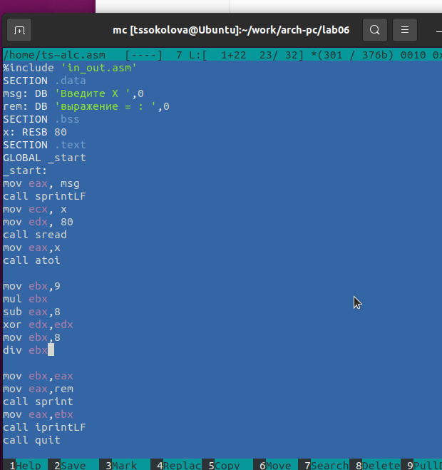{ #fig:016 width=70%, height=70% }

При $x=8$ получается  8.

При $x=64$ получается  71.

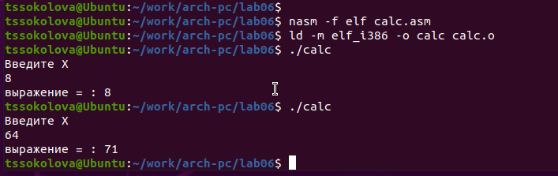{ #fig:017 width=70%, height=70% }

Программа считает верно.

# Выводы

Изучили работу с арифметическими операциями.