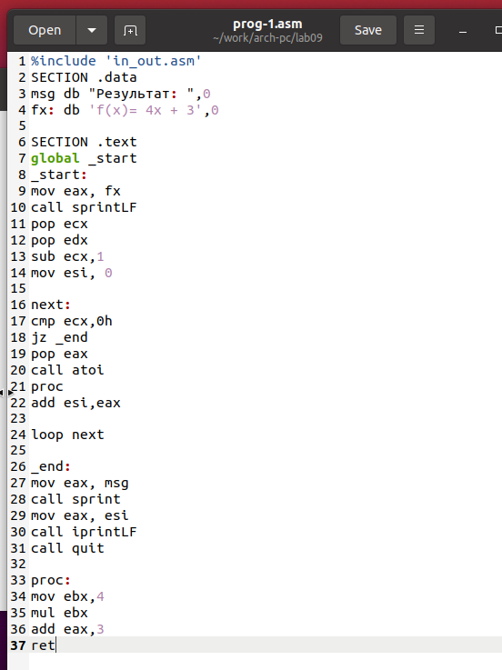

---
## Front matter
title: "Отчёт по лабораторной работе 9"
subtitle: "Понятие подпрограммы. Отладчик GDB."
author: "Татьяна Соколова НММбд-03-24"

## Generic otions
lang: ru-RU
toc-title: "Содержание"

## Bibliography
bibliography: bib/cite.bib
csl: pandoc/csl/gost-r-7-0-5-2008-numeric.csl

## Pdf output format
toc: true # Table of contents
toc-depth: 2
lof: true # List of figures
lot: true # List of tables
fontsize: 12pt
linestretch: 1.5
papersize: a4
documentclass: scrreprt
## I18n polyglossia
polyglossia-lang:
  name: russian
  options:
	- spelling=modern
	- babelshorthands=true
polyglossia-otherlangs:
  name: english
## I18n babel
babel-lang: russian
babel-otherlangs: english
## Fonts
mainfont: PT Serif
romanfont: PT Serif
sansfont: PT Sans
monofont: PT Mono
mainfontoptions: Ligatures=TeX
romanfontoptions: Ligatures=TeX
sansfontoptions: Ligatures=TeX,Scale=MatchLowercase
monofontoptions: Scale=MatchLowercase,Scale=0.9
## Biblatex
biblatex: true
biblio-style: "gost-numeric"
biblatexoptions:
  - parentracker=true
  - backend=biber
  - hyperref=auto
  - language=auto
  - autolang=other*
  - citestyle=gost-numeric
## Pandoc-crossref LaTeX customization
figureTitle: "Рис."
tableTitle: "Таблица"
listingTitle: "Листинг"
lofTitle: "Список иллюстраций"
lotTitle: "Список таблиц"
lolTitle: "Листинги"
## Misc options
indent: true
header-includes:
  - \usepackage{indentfirst}
  - \usepackage{float} # keep figures where there are in the text
  - \floatplacement{figure}{H} # keep figures where there are in the text
---

# Цель работы

Целью работы является приобретение навыков написания программ с использованием подпрограмм.
Знакомство с методами отладки при помощи GDB и его основными возможностями.

# Выполнение лабораторной работы

## Реализация подпрограмм в NASM

Сначала я создала новую папку, чтобы выполнять лабораторную работу номер 9, и перешла 
в нее. Затем я создала файл с именем lab9-1.asm.

В качестве примера, я рассмотрела программу, которая вычисляет арифметическое выражение 
$f(x) = 2x+7$ с использованием подпрограммы calcul. В этом примере значение переменной 
$x$ вводится с клавиатуры, а само выражение вычисляется внутри подпрограммы.(рис. [-@fig:001]) (рис. [-@fig:002])

{ #fig:001 width=70%, height=70% }

{ #fig:002 width=70%, height=70% }

После этого я внесла изменения в текст программы, добавив подпрограмму subcalcul 
внутрь подпрограммы calcul. Это позволило вычислить составное выражение 
$f(g(x))$, где значение $x$ также вводится с клавиатуры. Функции определены 
следующим образом: $f(x) = 2x + 7$, $g(x) = 3x - 1$.(рис. [-@fig:003]) (рис. [-@fig:004])

{ #fig:003 width=70%, height=70% }

{ #fig:004 width=70%, height=70% }

## Отладка программам с помощью GDB

Я создала файл с названием lab9-2.asm, в котором содержится программа из Листинга 9.2. 
Эта программа отвечает за вывод сообщения "Hello world!" на экран.(рис. [-@fig:005])

{ #fig:005 width=70%, height=70% }

После этого я скомпилировала файл и получила исполняемый файл. Чтобы добавить отладочную информацию для работы с отладчиком GDB, 
я использовала ключ "-g". Затем я загрузила полученный исполняемый файл в 
отладчик GDB и проверила его работу, запустив программу с помощью команды "run" 
или "r". (рис. [-@fig:006])

{ #fig:006 width=70%, height=70% }

Для более детального анализа программы я установила точку остановки на метке 
"start", с которой начинается выполнение любой ассемблерной программы, 
и запустила ее. Затем я просмотрела дизассемблированный код программы.(рис. [-@fig:007]) (рис. [-@fig:008])

{ #fig:007 width=70%, height=70% }

{ #fig:008 width=70%, height=70% }

Чтобы проверить точку остановки по имени метки "_start", 
я использовала команду "info breakpoints" или "i b". Затем я установила еще 
одну точку остановки по адресу инструкции, определив адрес предпоследней инструкции 
"mov ebx, 0x0". (рис. [-@fig:009])

{ #fig:009 width=70%, height=70% }

В отладчике GDB у меня была возможность просматривать содержимое ячеек 
памяти и регистров, а также изменять значения регистров и переменных. 
Я выполнила 5 инструкций с помощью команды 'stepi' (сокращенно 'si') и отслеживала 
изменение значений регистров. (рис. [-@fig:010]) (рис. [-@fig:011])

{ #fig:010 width=70%, height=70% }

{ #fig:011 width=70%, height=70% }

Я также просмотрела значение переменной msg1 по имени и получила нужные данные.
Чтобы изменить значение регистра или ячейки памяти, я использовала команду 
'set', указав имя регистра или адрес в качестве аргумента. 
Я изменила первый символ переменной msg1. (рис. [-@fig:012]) (рис. [-@fig:013])

{ #fig:012 width=70%, height=70% }

{ #fig:013 width=70%, height=70% }

Также, с помощью команды 'set', я изменила значение регистра ebx на нужное значение.(рис. [-@fig:014])

{ #fig:014 width=70%, height=70% }

Я скопировала файл lab8-2.asm, который был создан во время выполнения 
лабораторной работы №8. Этот файл содержит программу для вывода аргументов командной 
строки. Затем я создала исполняемый файл из скопированного файла.

Для загрузки программы с аргументами в отладчик GDB, я использовала ключ --args 
и загрузила исполняемый файл в отладчик с указанными аргументами. 
Я установила точку останова перед первой инструкцией программы и запустила ее. 

Адрес вершины стека, где хранится количество аргументов командной строки 
(включая имя программы), находится в регистре esp. По этому адресу находится число, 
указывающее количество аргументов. В данном случае я увидела, что количество аргументов 
равно 5, включая имя программы lab9-3 и сами аргументы: аргумент1, аргумент2 и 
'аргумент 3'.

Я также просмотрела остальные позиции стека. 
По адресу [esp+4] находится адрес в памяти, где располагается имя программы. 
По адресу [esp+8] хранится адрес первого аргумента, по адресу [esp+12] - второго и так 
далее. Шаг изменения адреса равен 4, так как каждый следующий адрес на стеке находится 
на расстоянии 4 байт от предыдущего ([esp+4], [esp+8], [esp+12]). (рис. [-@fig:015])

{ #fig:015 width=70%, height=70% }

## Задание для самостоятельной работы

Я решила преобразовать программу из лабораторной работы №8 
(Задание №1 для самостоятельной работы), добавив вычисление значения функции f(x) 
в виде подпрограммы. (рис. [-@fig:016]) (рис. [-@fig:017])

{ #fig:016 width=70%, height=70% }

{ #fig:017 width=70%, height=70% }

В листинге представлена программа для вычисления выражения $(3+2)*4+5$. 
Однако, при запуске программы, я обнаружила, что она дает неверный результат. 
Чтобы разобраться в причинах, я провела анализ изменений значений регистров с 
помощью отладчика GDB.

В результате анализа, я обнаружила, что порядок аргументов у инструкции add был 
перепутан. Кроме того, я заметила, что по окончании работы программы, значение ebx 
было отправлено в edi вместо eax.(рис. [-@fig:018])

{ #fig:018 width=70%, height=70% }

{ #fig:019 width=70%, height=70% }

Отмечу, что перепутан порядок аргументов у инструкции add и что по окончании работы в edi 
отправляется ebx вместо eax (рис. [-@fig:019])

Исправленный код программы (рис. [-@fig:020]) (рис. [-@fig:021])

{ #fig:020 width=70%, height=70% }

{ #fig:021 width=70%, height=70% }

# Выводы

Освоили работy с подпрограммами и отладчиком.